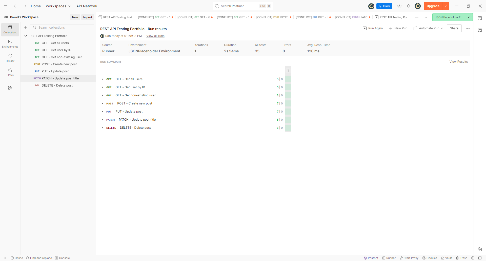

# REST API Testing with Postman

This repository contains a small REST API testing project I created while practicing API testing in Postman.

I used the JSONPlaceholder API to work with different HTTP methods, validate responses and create automated checks in Postman.

## API

The project uses the public JSONPlaceholder REST API:

`https://jsonplaceholder.typicode.com`

JSONPlaceholder is a test API, so POST, PUT, PATCH and DELETE requests are simulated and changes are not permanently saved on the server.

## What I tested

The collection contains the following requests:

| Method | Request | What is checked |
|---|---|---|
| GET | Get all users | Status code, response structure, required user fields |
| GET | Get user by ID | User data and ID |
| GET | Get non-existing user | 404 response and empty response body |
| POST | Create new post | Resource creation and returned data |
| PUT | Update post | Full update of an existing resource |
| PATCH | Update post title | Partial update of a resource |
| DELETE | Delete post | Successful delete response |

## Postman tests

I added Postman scripts to check the API responses automatically. They cover:

- HTTP status codes
- JSON response structure
- required fields
- response data
- Content-Type header
- response time
- empty response body
- dynamic values

Example:

```javascript
pm.test("Status code is 200", function () {
    pm.response.to.have.status(200);
});
```

For a non-existing user I check both the `404` status and the returned response body:

```javascript
pm.test("Status code is 404", function () {
    pm.response.to.have.status(404);
});

pm.test("Response body is empty object", function () {
    const jsonData = pm.response.json();

    pm.expect(jsonData).to.be.an("object");
    pm.expect(jsonData).to.be.empty;
});
```

## Variables

Instead of hardcoding the API address in every request, I created a Postman environment with a `baseUrl` variable:

```text
baseUrl = https://jsonplaceholder.typicode.com
```

Requests can then use URLs such as:

```text
{{baseUrl}}/users
```

I also wanted to practice passing data between requests. The first GET request saves a user ID from the response:

```javascript
const users = pm.response.json();
pm.environment.set("userId", users[0].id);
```

The saved value is then used in another request:

```text
{{baseUrl}}/users/{{userId}}
```

## Test execution

I ran the complete collection using Postman Collection Runner to check all requests and assertions together.



## Repository contents

```text
api-testing-postman-portfolio/
├── README.md
├── postman/
│   ├── REST_API_Testing_Portfolio.postman_collection.json
│   └── JSONPlaceholder_Environment.postman_environment.json
└── screenshots/
    └── Postman_Collection_Run.png
```

## How to run

1. Clone or download this repository.
2. Import the collection from the `postman` folder into Postman.
3. Import `JSONPlaceholder_Environment.postman_environment.json`.
4. Select the `JSONPlaceholder Environment`.
5. Run individual requests or use Collection Runner to execute the whole collection.

## Tools used

- Postman
- REST API
- JSON
- JavaScript (basic Postman test scripts)
- Git / GitHub

## What I learned

This project helped me better understand how REST APIs work in practice, especially the differences between GET, POST, PUT, PATCH and DELETE requests.

I also practiced checking status codes and JSON responses, writing basic automated assertions in Postman, using environment variables and passing values between requests.

---

**Paweł Iwaszko**  
ISTQB® Certified Tester Foundation Level  
Junior Manual QA Tester
